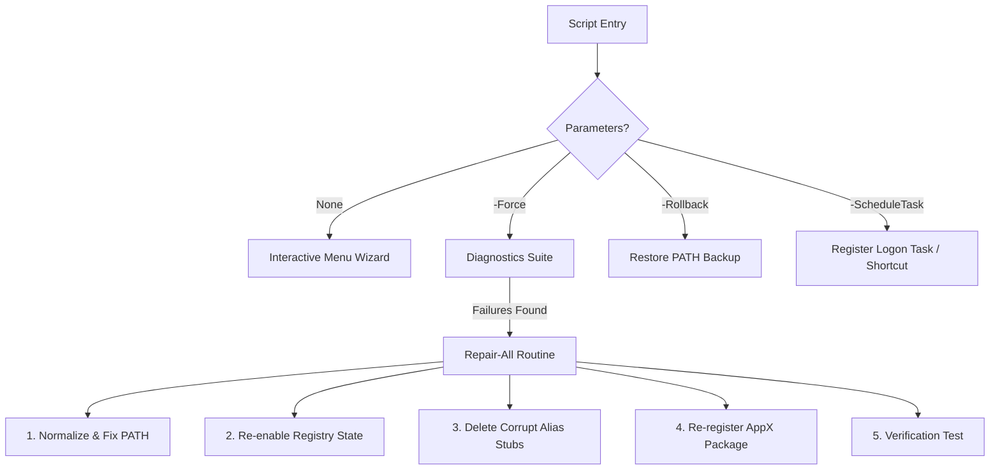

# Winget Diagnostic and Remediation Tool

A professional, PowerShell-based diagnostic and remediation script to fix the Winget "Open With" execution alias loop on Windows 11.

---

## 1. USER GUIDE

This section is for end-users and administrators who want to diagnose and resolve Winget execution failures.

### Prerequisites
PowerShell restricts script execution by default. To run this script:
1. Open PowerShell.
2. Run the following command to temporarily bypass execution policy for the current process:
   ```powershell
   Set-ExecutionPolicy -ExecutionPolicy Bypass -Scope Process
   ```

### Execution Modes

#### Interactive Menu Wizard (Default)
Run the script without parameters to open the guided console interface:
```powershell
.\Repair-WingetAlias.ps1
```
This wizard provides step-by-step menu options to check status, fix environment paths, re-register packages, configure registry settings, or restore backups.

#### Safe Dry-Run (What-If Mode)
Validate what changes the script would apply to the registry or files without making any modifications:
```powershell
.\Repair-WingetAlias.ps1 -WhatIf -Force
```

#### Automated Full Repair (Unattended Mode)
Analyze and apply all path, registry, and package repairs automatically:
```powershell
.\Repair-WingetAlias.ps1 -Force
```

#### Scheduled / Continuous Repair
Ensure the Winget execution loop remains fixed across logons. This command dynamically selects the best mechanism based on your session's privileges:
```powershell
.\Repair-WingetAlias.ps1 -ScheduleTask
```
- **If Elevated (Admin)**: Registers a Scheduled Task under the current user context.
- **If Non-Elevated (Standard)**: Creates a silent shortcut inside the user's personal Startup folder (`%APPDATA%\Microsoft\Windows\Start Menu\Programs\Startup`).

#### Roll Back Modifications
Restore your previous environment settings and PATH variable:
```powershell
.\Repair-WingetAlias.ps1 -Rollback
```

---

## 2. DEVELOPER GUIDE

This section is for engineers who want to understand, maintain, or extend the tool.

### Architecture Overview
The script is composed of independent, modular functions that target specific Windows subsystems.



### Subsystem Details

#### 1. PATH Normalization (`Repair-EnvironmentPath`)
- **Location**: `HKCU:\Environment` (User Environment block).
- **Registry Type**: `REG_EXPAND_SZ` (`ExpandString`) to ensure nested variables like `%USERPROFILE%` expand properly.
- **Security Check**: Writes/deletes a temporary key (`RepairWingetWriteTest`) to catch read-only user hives before making modifications.
- **Cleaning**: Splits PATH by `;`, filters out whitespace/empty entries, performs case-insensitive duplicate checks on expanded paths, and joins the final array using `.Trim(';')`.

#### 2. AppX Package Diagnostics (`Repair-AppXInstallerPackage`)
- **Package Family**: `Microsoft.DesktopAppInstaller_8wekyb3d8bbwe`
- **Cmdlets Used**: `Get-AppxPackage`, `Add-AppxPackage`, `Reset-AppxPackage`.
- **Physical Verification**: Validates that `$pkg.InstallLocation` points to an existing folder in `C:\Program Files\WindowsApps`. If missing, warns the developer of system file corruption.

#### 3. Execution Alias Registry Toggles
- **Location**: `HKCU:\Software\Microsoft\Windows\CurrentVersion\AppX\AppExecutionAliasSettings\Microsoft.DesktopAppInstaller_8wekyb3d8bbwe\winget.exe`
- **Key Settings**: The `State` DWORD value must be set to `1`. If disabled (`0`), the script overrides it to `1`.

#### 4. Reparse Point Stub Cleanup (`Remove-ReparsePoint`)
- **Stub Folder**: `%LOCALAPPDATA%\Microsoft\WindowsApps\`
- **Stubs Targeted**: `winget.exe` and `wingetdev.exe`.
- **API**: Uses the .NET API `[System.IO.File]::Delete($Path)` to bypass PowerShell `Remove-Item` exceptions on corrupted reparse points.

---

## 3. AI / AGENTIC INTERFACE GUIDE

This section provides specifications for other AI agents to execute, parse, and automate operations using this script.

### Script Parameter Schema

| Parameter | Type | Default | Description |
| :--- | :--- | :--- | :--- |
| `-Force` | Switch | `$false` | Runs diagnostics and repairs silently in the foreground. |
| `-Rollback` | Switch | `$false` | Restores `PATH` environment variable from previous backup key or latest `.reg` file. |
| `-AsJob` | Switch | `$false` | Spawns the script asynchronously as a background PowerShell Job. |
| `-DownloadFallback` | Switch | `$false` | Downloads and installs the latest official `.msixbundle` from Microsoft's GitHub if missing. |
| `-ScheduleTask` | Switch | `$false` | Installs logon task or startup shortcut. |
| `-WhatIf` | Switch | `$false` | standard dry-run parameter (inherits `SupportsShouldProcess`). |

### Automated Script Execution (Agent Integration)
To run this tool inside an automated pipeline without user intervention:

```powershell
powershell.exe -NonInteractive -NoProfile -ExecutionPolicy Bypass -File ".\Repair-WingetAlias.ps1" -Force -DownloadFallback
```

### Log File Parsing (`Repair-WingetAlias.log`)
The script outputs structured log lines containing timestamps and levels (`Info`, `Success`, `Warn`, `Error`). 

**Regex Pattern for Log Parsing**:
```regex
^\[(?<Timestamp>\d{4}-\d{2}-\d{2} \d{2}:\d{2}:\d{2})\] \[(?<Level>\w+)\] (?<Message>.*)$
```

### Return Values & Exit Codes
- **Exit Code 0**: Operation completed successfully (all diagnostics passed or repairs succeeded).
- **Exit Code 1**: Script encountered a parser, registry write permission, or critical verification failure.
