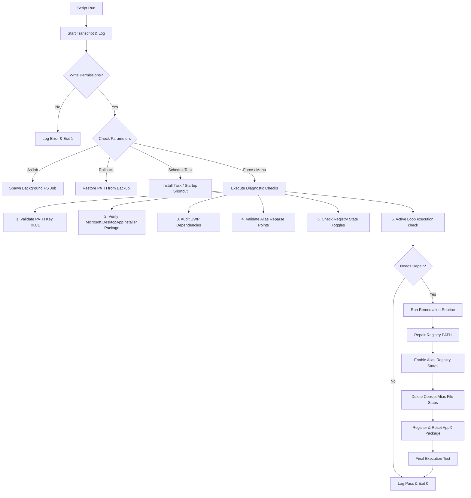

# Winget Diagnostic & Remediation Tool

[](https://github.com/aj1126/Winget-Diagnostic-Tool/actions/workflows/lint.yml)

A production-grade, single-profile PowerShell utility designed to diagnose and repair Windows Package Manager (`winget`) execution loops, corrupted reparse points, and registry PATH inconsistencies on Windows 11.

> **Status**: ✅ Complete — 60/60 E2E tests passing, forensic audit clean, independently verified.

---

## 1. PRODUCT OVERVIEW

On Windows 11, the `winget` command-line tool executes via an **AppExecutionAlias**—a specialized NTFS reparse point located in `%LOCALAPPDATA%\Microsoft\WindowsApps`. 

Corruption of this alias, missing user environment PATH entries, or disabled app execution settings in Windows can lead to:
1. **The "Open With" Loop**: Windows fails to resolve the execution alias target and continuously prompts the user to select an application to open `winget.exe`.
2. **Command Not Found Errors**: Shells fail to locate `winget` due to missing directory references in the User registry.

This tool provides a safe, non-destructive, and reversible diagnostics and remediation pipeline running entirely within the current user's profile context (no administrative privileges required for core repairs).

### Compatibility
- **Windows PowerShell 5.1** (default on Windows 11)
- **PowerShell 7+** (PowerShell Core)
- Runs safely under standard user, elevated administrator, interactive, and non-interactive contexts.

---

## 2. USER GUIDE

This section covers interactive use, deployment options, and emergency rollback procedures.

### Prerequisites & Policy Bypass
By default, Windows blocks script execution. To run this script in an active PowerShell session, bypass the execution policy for the current process:
```powershell
Set-ExecutionPolicy -ExecutionPolicy Bypass -Scope Process
```

### Execution Modes

#### Interactive Wizard (Default)
Run the script without arguments to launch the text-based console menu:
```powershell
.\Repair-WingetAlias.ps1
```
The wizard will guide you through running diagnostics, performing repairs, setting up logon automation, or rolling back changes.

#### Automated Remediate-All (Unattended)
Perform full diagnostic checks and apply all necessary repairs automatically:
```powershell
.\Repair-WingetAlias.ps1 -Force
```

#### Safe Dry-Run (What-If / Dry-Run Mode)
Preview registry changes, file deletions, and package registrations without applying any modifications:
```powershell
.\Repair-WingetAlias.ps1 -DryRun
# Or use standard PowerShell WhatIf support:
.\Repair-WingetAlias.ps1 -WhatIf -Force
```

#### Scheduled Continuous Repair
Ensure `winget` remains functional after Windows Updates or profile changes. The script automatically chooses the safest installation method based on your access level:
```powershell
.\Repair-WingetAlias.ps1 -ScheduleTask
```
* **Elevated Session (Admin)**: Registers a native Windows Scheduled Task under your user account to run at logon.
* **Standard Session (User)**: Generates a silent startup shortcut in:
  `%APPDATA%\Microsoft\Windows\Start Menu\Programs\Startup\Repair-WingetAlias.lnk`

#### Background Execution
Run the script as a background PowerShell job:
```powershell
.\Repair-WingetAlias.ps1 -AsJob -Force
```

#### Download Missing Package
If the `Microsoft.DesktopAppInstaller` AppX package is completely missing, the script can download and install it from Microsoft's official GitHub releases:
```powershell
.\Repair-WingetAlias.ps1 -Force -DownloadFallback
```

#### Rollback Changes
Restore the previous PATH from the backup registry key or `.reg` file:
```powershell
.\Repair-WingetAlias.ps1 -Rollback
```

---

## 3. DEVELOPER GUIDE

This section explains the internals, registry changes, and dependency requirements.

### Architecture Workflow



### Registry Modifications Reference

| Target Subsystem | Registry Path | Expected State |
| :--- | :--- | :--- |
| **User environment block** | `HKCU:\Environment` | `PATH` must contain `%LOCALAPPDATA%\Microsoft\WindowsApps`. Value kind must be `REG_EXPAND_SZ` (`ExpandString`). |
| **Winget Alias Toggle** | `HKCU:\Software\Microsoft\Windows\CurrentVersion\AppX\AppExecutionAliasSettings\Microsoft.DesktopAppInstaller_8wekyb3d8bbwe\winget.exe` | `State` DWORD value must be `1` (Enabled). |
| **Winget Dev Alias Toggle** | `HKCU:\Software\Microsoft\Windows\CurrentVersion\AppX\AppExecutionAliasSettings\Microsoft.DesktopAppInstaller_8wekyb3d8bbwe\wingetdev.exe` | `State` DWORD value must be `1` (Enabled). |
| **Backup Registry Key** | `HKCU:\Environment\PATH_PreRepairBackup` | Stores the original `PATH` string prior to any modifications. Deleted upon rollback. |

### Advanced Technical Implementations
1. **Safety Registry Operations**: The script directly queries raw Registry values using `.GetValue("PATH", "", [Microsoft.Win32.RegistryValueOptions]::DoNotExpandEnvironmentNames)` to avoid flattening environment variables during backups.
2. **Reparse Point Deletion**: Standard PowerShell `Remove-Item` fails on corrupted or orphaned reparse points. The script bypasses this by utilizing .NET's `[System.IO.File]::Delete($Path)`, with a fallback to `cmd.exe /c del /f /q` if the .NET call fails.
3. **Active Loop Detection**: The script monitors spawned test-executions in a separate background thread with a 3-second timeout. If the process hangs or spawns `OpenWith.exe`, it is flagged as an active execution loop, and the processes are immediately terminated.
4. **Elevated Targeting of Logged-In User Profile**: When executed in an elevated Administrator session, the script does not default to the Administrator's own profile. Instead, it dynamically resolves the currently active standard user profile by detecting the owner of the `explorer.exe` process or querying `Win32_ComputerSystem.UserName`. It translates their SID to target the correct user hive under `HKEY_USERS\<SID>` and performs file operations in their `%LOCALAPPDATA%`, providing comprehensive remediation coverage for the target user while running elevated.
5. **TLS 1.3 Dynamic Resolution**: The `-DownloadFallback` pathway dynamically resolves the `Tls13` enum value (12288) on older .NET runtimes that lack native support for it, ensuring secure HTTPS downloads on all supported PowerShell versions.
6. **Log Rotation**: Both `Repair-WingetAlias.log` and `Repair-WingetAlias_Transcript.log` are automatically rotated to `.bak` when they exceed 1MB.

### Branch Governance & Security Gates
To ensure stability, compliance, and regression control in the distribution pipeline, this repository implements the following branch protection rules:
- **Commit & History Protections**: Force-pushes (`git push --force`) and branch deletions are strictly blocked on the `main` branch to guarantee a permanent, immutable commit ledger.
- **Mandatory Code Gates**: All integrations targeting the `main` branch require a formal Pull Request (PR) with at least 1 linear code approval.
- **Conversation Resolution**: Merging is blocked until all review conversations and architectural threads are explicitly marked as completely resolved.
- **Blocking CI Status Checks**: Automated static code analysis checks (`Analyze and Run PSScriptAnalyzer` defined in `lint.yml` and `release.yml`) are configured as mandatory, non-skippable blocking nodes in the merge pipeline.

---

## 4. TESTING

The project includes a comprehensive E2E test suite with **60 test cases** across 4 tiers.

### Running Tests
```powershell
powershell.exe -NoProfile -ExecutionPolicy Bypass -File tests/Run-Tests.ps1
```
Exit code `0` indicates all tests passed. Exit code `1` indicates one or more failures.

### Test Architecture
Each test case runs in a **completely isolated child process** with:
- Sandboxed temporary directories for registry and file system simulation
- C# compiled mock executables (`winget.exe` with configurable behaviors: success, fail, hang)
- Type accelerator overrides for `[System.IO.File]` via a custom `MockFile` class to simulate reparse point attributes and deletion failures
- Mock registry, AppX package, and admin identity contexts injected via JSON setup files

### Coverage Summary

| Tier | Focus | Count | Pass Rate |
|---|---|---|---|
| **Tier 1** | Feature Coverage (PATH, AppX, Aliases, Stubs, Scheduling) | 25 | 100% |
| **Tier 2** | Boundary & Corner Cases (empty PATH, Unicode, concurrent access) | 25 | 100% |
| **Tier 3** | Cross-Feature Combinations (rollback, DryRun, backup integrity) | 5 | 100% |
| **Tier 4** | Real-World Scenarios (healthy system, full repair, Open With loop) | 5 | 100% |
| **Total** | | **60** | **100%** |

For detailed test architecture documentation, see [TEST_INFRA.md](TEST_INFRA.md).

---

## 5. AI / AGENTIC INTERFACE GUIDE

This section defines specifications for other AI agents to execute, parse, and automate operations using this script.

### Script Parameter Schema

| Parameter | Type | Default | Description |
| :--- | :--- | :--- | :--- |
| `-Force` | Switch | `$false` | Bypasses interactive menus and applies repairs automatically. |
| `-Rollback` | Switch | `$false` | Restores previous PATH value and cleans up backup logs. |
| `-AsJob` | Switch | `$false` | Spawns the script asynchronously as a background PowerShell Job. |
| `-DownloadFallback` | Switch | `$false` | Downloads and installs the latest official `.msixbundle` from Microsoft's GitHub if the local package is missing. |
| `-ScheduleTask` | Switch | `$false` | Installs the logon Scheduled Task or Startup shortcut. |
| `-DryRun` | Switch | `$false` | Simulates all diagnostic and repair steps without modifying the registry or deleting files. |
| `-WhatIf` | Switch | `$false` | Standard dry-run parameter (inherits `SupportsShouldProcess`). |

### Execution Templates

#### Asynchronous Execution (Fire and Forget)
Agents can launch the script in the background and track the job status:
```powershell
$Job = Start-Job -FilePath ".\Repair-WingetAlias.ps1" -ArgumentList "-Force", "-DownloadFallback"
```

#### CLI Log Analysis
The script maintains a structured, time-stamped execution log in `Repair-WingetAlias.log` and a transcript in `Repair-WingetAlias_Transcript.log`.

**Structured Log Regex**:
```regex
^\[(?<Timestamp>\d{4}-\d{2}-\d{2} \d{2}:\d{2}:\d{2})\] \[(?<Level>Info|Success|Warn|Error)\] (?<Message>.*)$
```

### Exit Codes & Diagnostics
The script returns the following process exit codes:
- **`0`**: Success. All diagnostic checks passed, or repair operations completed and verified successfully.
- **`1`**: Critical Failure. Encountered access restrictions, registry write permission failures, or the active loop persisted after remediation.
- **`2`**: Package Missing. The `Microsoft.DesktopAppInstaller` AppX package is missing and `-DownloadFallback` was not specified.
- **`3`**: Execution Policy Blocked. Script execution is restricted on the system.

---

## License

This project is provided as-is for diagnostic and remediation purposes on Windows 11.
