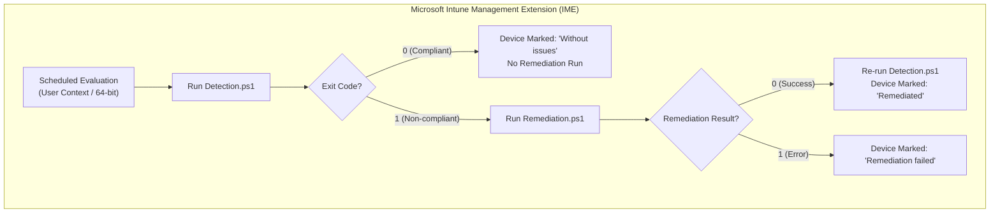

# Microsoft Intune Proactive Remediation Guide

This directory contains standalone, enterprise-ready **Detection** and **Remediation** scripts designed for deployment via **Microsoft Intune Endpoint Analytics (Proactive Remediations)** to automatically detect and heal Windows Package Manager (`winget`) execution alias corruption and "Open With" loop errors across managed Windows 10/11 endpoints.

---

## 🎯 Architecture Overview

### Dual-Tier Execution Engine
Both scripts are engineered with a **Hybrid Architecture**:
1. **Tier 1 (Module-Aware)**: If `WingetDiagnosticTool` is installed or imported locally, the scripts leverage the high-performance compiled module cmdlets (`Run-Diagnostics`, `Repair-AppExecutionAliases`, `Repair-AliasStubs`, `Repair-EnvironmentPath`, `Repair-AppXInstallerPackage`).
2. **Tier 2 (Zero-Dependency Standalone Fallback)**: If the module is **not** present (the standard Intune scenario where only single `.ps1` files are downloaded into the IME cache), the scripts execute lightweight embedded .NET and Registry routines with **zero external file or internet dependencies**.

---

## 📋 Microsoft Intune Configuration Settings

Follow these steps to deploy the script package in the **Microsoft Intune Admin Center**:

1. Navigate to: **Devices** > **Scripts and remediations** (under *Manage devices*) > **Create**.
2. **Basics Tab**:
   - **Name**: `Remediate Winget Execution Alias and OpenWith Loop`
   - **Description**: `Detects and repairs corrupted DesktopAppInstaller AppExecutionAliases and user PATH settings for winget.`
   - **Publisher**: `IT Operations / System Administration`
3. **Settings Tab**:
   - **Detection script file**: Upload [`intune/Detection.ps1`](./Detection.ps1)
   - **Remediation script file**: Upload [`intune/Remediation.ps1`](./Remediation.ps1)
   - **Run this script using the logged-on credentials**: **Yes** *(CRITICAL: Execution aliases and user environment hives exist in HKCU and %LOCALAPPDATA%)*
   - **Enforce script signature check**: **No** *(or Yes if your organization signs internal scripts)*
   - **Run script in 64-bit PowerShell**: **Yes**
4. **Scope tags Tab**: (Optional) Assign appropriate scope tags.
5. **Assignments Tab**:
   - Assign to target Entra ID device/user groups.
   - **Schedule**: Configure schedule (e.g., **Daily** at a convenient time or **Once every 8 hours** for high-drift environments).
6. **Review + create**: Verify configuration and select **Create**.

---

## 🚦 Exit Code & Telemetry Specification

Both scripts emit standardized exit codes and formatted `STDOUT` telemetry captured directly in the Intune Endpoint Analytics portal (up to 2048 characters):

### Detection.ps1
| Exit Code | Intune Status | Description | Telemetry Example |
| :---: | :---: | :--- | :--- |
| `0` | **Compliant** | All health checks passed; `winget.exe` is healthy. | `Compliant: Winget execution alias and environment are healthy (Version: v1.22.11261).` |
| `1` | **Non-compliant** | One or more alias, path, or registry issues detected; triggers remediation. | `Non-compliant: Winget alias issues detected: Winget execution alias is explicitly DISABLED in registry (State = 0). Remediation required.` |

### Remediation.ps1
| Exit Code | Intune Status | Description | Telemetry Example |
| :---: | :---: | :--- | :--- |
| `0` | **Success** | Remediation actions applied; alias verified healthy. | `Success: Winget execution alias successfully remediated (Version: v1.22.11261). Actions: Repaired AppExecutionAlias registry settings; Cleaned corrupted alias stubs.` |
| `1` | **Failure** | Remediation failed or execution timed out. | `Error: Remediation failed to restore healthy winget execution.` |

---

## 🛡️ Enterprise Safety & Security Safeguards

- **Detection Makes No Repairs**: `Detection.ps1` changes no registry values, alias files or `PATH` entries. It is not fully read-only: with the module present (Tier 1) it writes its log to `%LOCALAPPDATA%\WingetDiagnosticTool\Repair-WingetAlias.log`, and if a winget probe opens the "Open With" dialog it force-stops every running `OpenWith` process it has the rights to stop, not only the one the probe opened.
- **SYSTEM Context Guard**: Both scripts actively detect if accidentally run as `NT AUTHORITY\SYSTEM` and immediately emit a helpful configuration error rather than falsely modifying system hives.
- **Non-Blocking 3-Second Probe**: Prevents the infamous "Open With" GUI dialog loop from hanging the Intune Management Extension process.
- **Non-Destructive Repairs**: Low-level .NET deletions target only non-reparse point corrupted stub files, safely leaving valid NTFS junction points intact.

---

## 🏢 On-Premises & Hybrid Deployment (SCCM / MECM / MDT)

For on-premises OSD imaging, Active Setup multi-user staging, or Configuration Manager Task Sequences, see the [Microsoft SCCM / MECM & MDT Task Sequence Deployment Guide](../sccm/README.md).

