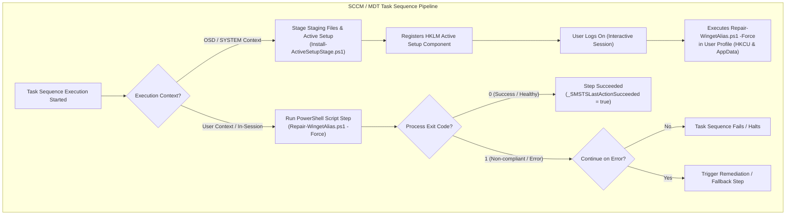

# Microsoft SCCM / MECM & MDT Task Sequence Deployment Guide

This directory provides enterprise integration guides, exit-code mapping specifications, and deployment automation scripts for deploying the **Winget Diagnostic & Remediation Tool** across managed Windows 10/11 fleets via **Microsoft Endpoint Configuration Manager (SCCM / MECM)** and **Microsoft Deployment Toolkit (MDT)**.

---

## 🎯 Architecture Overview



---

## ⚠️ The Core Architectural Challenge: SYSTEM vs. User Context

In enterprise imaging and operating system deployments (OSD), task sequences by default execute under the **`NT AUTHORITY\SYSTEM`** account:

* **The Problem**: Windows Package Manager (`winget`) execution aliases and environment variables exist strictly within the individual user's profile:
  - User PATH environment: `HKCU:\Environment\PATH`
  - AppExecutionAlias state: `HKCU:\Software\Microsoft\Windows\CurrentVersion\AppX\AppExecutionAliasSettings`
  - Reparse points / stubs: `%LOCALAPPDATA%\Microsoft\WindowsApps\`
* **The Consequence**: Executing repair scripts under `SYSTEM` during bare-metal deployment or before any user has logged in cannot modify non-existent user profile hives.
* **The Solutions**: Supported deployment patterns address this through three distinct enterprise mechanisms:
  1. **Active Setup (Recommended for OSD Imaging)**: Register once in `HKLM` during State Restore; runs automatically once per user upon interactive logon.
  2. **Post-Logon Package / Application Deployment**: Configured to run strictly with user rights when a user is logged on.
  3. **SCCM Compliance Settings (Configuration Item & Baseline)**: Continuous background audit and remediation running under user credentials.

---

## 🚦 Deterministic Exit Code Specification

Deployment engines (SCCM Task Sequences, MDT LiteTouch, RMM tools) rely on strict process return codes to evaluate step success and conditional branching. `Repair-WingetAlias.ps1` and its standalone modules adhere to deterministic exit-code contracts:

| Exit Code | Classification | Meaning | Task Sequence Implication |
| :---: | :--- | :--- | :--- |
| `0` | **Success / Compliant** | System is healthy, all execution aliases valid, or repair completed successfully. | Step passes (`_SMSTSLastActionSucceeded = true`). Pipeline proceeds to next step. |
| `1` | **Failure / Non-compliant** | Diagnostic inspection failed, alias disabled, stub corrupted, or remediation timed out. | Step fails (`_SMSTSLastActionSucceeded = false`). Pipeline halts unless *Continue on error* is checked. |
| `2` | **Dry-Run Completed** | Script executed with `-DryRun` or `-WhatIf`. Inspection performed; no mutations applied. | Treated as Success by default unless custom exit-code conditions are defined. |
| `3` | **Rollback Succeeded** | Script executed with `-Rollback`. Environment PATH restored from backup. | Rollback confirmed. |
| `3010` | **Soft Reboot Required** | (Optional) Configurable if your custom task sequence step requires a system restart. | SCCM catches code 3010 and coordinates a planned reboot. |

> [!IMPORTANT]
> When executing PowerShell scripts in SCCM Task Sequences via the **Run Command Line** step, always ensure the command line explicitly exits with `$LASTEXITCODE`. PowerShell.exe without an explicit `exit` statement may exit with code `0` even if an unhandled terminating exception occurred in the child pipeline.

---

## 🛠️ Deployment Patterns & Step-by-Step Instructions

### Pattern 1: OSD Task Sequence via Active Setup (Imaging & State Restore)

This pattern stages `WingetDiagnosticTool` into `%ProgramData%\WingetDiagnosticTool` during the **State Restore** phase (running as `SYSTEM`), and registers an Active Setup component under `HKLM`. When any user later logs on, Windows Explorer automatically runs the repair script once in their user context.

#### Step 1: Create the SCCM Package
1. In the **SCCM Console**, navigate to: **Software Library** > **Application Management** > **Packages**.
2. Select **Create Package**.
3. **Package Details**:
   - **Name**: `Winget Diagnostic Tool - Enterprise Deployment`
   - **Source folder**: Point to the root directory containing `Repair-WingetAlias.ps1`, `WingetDiagnosticTool/`, and `sccm/`.
4. Distribute the package to your Distribution Points.

#### Step 2: Add Task Sequence Step
1. Edit your OSD Task Sequence (under **Software Library** > **Operating Systems** > **Task Sequences**).
2. Under the **State Restore** phase, add a **Run Command Line** step:
   - **Name**: `Stage Winget Diagnostic Active Setup`
   - **Command line**:
     ```cmd
     powershell.exe -NoProfile -ExecutionPolicy Bypass -File .\sccm\Install-ActiveSetupStage.ps1
     ```
   - **Package**: Check and select `Winget Diagnostic Tool - Enterprise Deployment`.
   - **Run this step as the following account**: Leave default (`NT AUTHORITY\SYSTEM`).
   - **Success codes**: `0`
   - **64-bit file system redirection**: no setting is needed. The step runs 32-bit PowerShell by default, and the script writes the Active Setup key through the 64-bit registry view, so the key never lands under `WOW6432Node` and `-Uninstall` finds it from either host.

To remove the component, run the same command line with `-Uninstall`. Re-staging a newer build is safe: the Active Setup `Version` follows the module version (`2.1.1` becomes `2,1,1`), so users who ran an older build run the repair once more at their next logon.

---

### Pattern 2: Post-Logon In-Session Package (Targeted Endpoint Repair)

Use this pattern to remediate existing endpoints where users are already logged in.

1. In the **SCCM Console**, create a Standard Program under the `Winget Diagnostic Tool` package:
2. **Program Settings**:
   - **Name**: `Remediate Winget User Aliases`
   - **Command line**:
     ```cmd
     powershell.exe -NoProfile -ExecutionPolicy Bypass -WindowStyle Hidden -File .\Repair-WingetAlias.ps1 -Force
     ```
   - **Run**: `Hidden`
   - **Program can run**: **Only when a user is logged on**
   - **Run mode**: **Run with user's rights** *(CRITICAL: Must have user token to access HKCU)*
   - **Drive mode**: `Runs with UNC name`
3. Deploy this program as **Required** or **Available** to your target Device or User Collections.

---

### Pattern 3: SCCM Configuration Item & Compliance Baseline (Continuous Drift Remediation)

For continuous, scheduled compliance auditing without task sequence overhead:

#### Step 1: Create Configuration Item (CI)
1. In the **SCCM Console**, navigate to: **Assets and Compliance** > **Compliance Settings** > **Configuration Items**.
2. Select **Create Configuration Item**.
3. **Settings**:
   - **Name**: `CI - Winget Execution Alias Health`
   - **Supported Platforms**: Windows 10 (64-bit), Windows 11 (64-bit).
4. **Settings Tab** > **New**:
   - **Name**: `Winget Health Discovery & Remediation`
   - **Setting type**: `Script`
   - **Data type**: `String`
5. **Discovery Script**:
   - Language: `Windows PowerShell`
   - Select **Run scripts by using the logged on user credentials**: **Yes**
   - Script: Use content from [`intune/Detection.ps1`](../intune/Detection.ps1) (or copy the detection block).
   - Expected Output Rule: Value must equal `Compliant`.
6. **Remediation Script**:
   - Language: `Windows PowerShell`
   - Select **Run scripts by using the logged on user credentials**: **Yes**
   - Script: Use content from [`intune/Remediation.ps1`](../intune/Remediation.ps1) or `.\Repair-WingetAlias.ps1 -Force`.
7. **Compliance Rules Tab**:
   - Rule: Value equals `Compliant`.
   - Check: **Run the specified remediation script when this setting is noncompliant**.
   - Check: **Report noncompliance if this setting instance is not found**.

#### Step 2: Add to Baseline & Deploy
1. Add the CI to a new or existing **Configuration Baseline**.
2. Deploy to target collections with evaluation schedule (e.g. **Every 1 Day**).

---

## 💻 MDT (Microsoft Deployment Toolkit) LiteTouch Integration

In MDT LiteTouch deployments:

1. Open **Deployment Workbench** > expand your Deployment Share > **Task Sequences**.
2. Open your Task Sequence > **Task Sequence** tab.
3. In the **State Restore** group, add a **Run PowerShell Script** step:
   - **Name**: `Stage Winget Active Setup`
   - **PowerShell script**: `%SCRIPTROOT%\Install-ActiveSetupStage.ps1`
   - **Parameters**: `-Force`
   - **Execution Policy**: `Bypass`
4. Alternatively, use a **Run Command Line** step:
   ```cmd
   powershell.exe -NoProfile -ExecutionPolicy Bypass -File "%SCRIPTROOT%\Install-ActiveSetupStage.ps1"
   ```

---

## 🔍 Task Sequence Variable & Error Handling Reference

### Handling Exit Codes with Task Sequence Conditions

In SCCM Task Sequences, conditional branching allows sysadmins to trigger actions only when non-compliance is detected:

```
├── Step 1: Run Detection Script (Continue on Error = True)
│     Command: powershell.exe -NoProfile -ExecutionPolicy Bypass -Command "& { .\intune\Detection.ps1; exit $LASTEXITCODE }"
├── Group: Remediate If Non-Compliant
│     Condition: Task Sequence Variable _SMSTSLastActionSucceeded = "false"
│     ├── Step 2a: Run Remediation Script
│     │     Command: powershell.exe -NoProfile -ExecutionPolicy Bypass -Command "& { .\intune\Remediation.ps1; exit $LASTEXITCODE }"
│     └── Step 2b: Verify Remediation
│           Command: powershell.exe -NoProfile -ExecutionPolicy Bypass -Command "& { .\intune\Detection.ps1; exit $LASTEXITCODE }"
```

### Log File Locations & Troubleshooting

When troubleshooting deployment steps, inspect the following diagnostic logs:

| Component | Log Path | What to Look For |
| :--- | :--- | :--- |
| **SCCM Task Sequence** | `C:\Windows\CCM\Logs\SMSTSLog\smsts.log` | Process exit code (`Process completed with exit code 0` vs `1`). |
| **SCCM Package/Program** | `C:\Windows\CCM\Logs\execmgr.log` | User token assignment and execution status. |
| **MDT LiteTouch** | `C:\Users\ADMINI~1\AppData\Local\Temp\SMSTSLog\BDD.log` | Script return code and console transcript. |
| **WingetDiagnosticTool** | `%LOCALAPPDATA%\WingetDiagnosticTool\Repair-WingetAlias.log` | Detailed step-by-step diagnostic actions and backup locations. |
| **Windows Event Viewer** | `Application` Log (Source: `WingetDiagnosticTool`) | Logged events when run with `-EventLog` flag. |

---

## 🛡️ Enterprise Safety & Security Controls

* **Zero Elevation Bleed**: Remediation commands strictly resolve user-level reparse points and environment variables without modifying the administrative system profile.
* **Non-Blocking 3,000 ms Probe**: Process watchdog prevents the notorious "Open With" interactive dialog loop from hanging the SCCM Task Sequence execution engine.
* **PSScriptAnalyzer Checked**: `Install-ActiveSetupStage.ps1`, `Repair-WingetAlias.ps1` and the two Intune scripts report 0 errors and 0 warnings; `Repair-WingetAlias.ps1` is checked on every pull request (`lint.yml`).
* **Automatic Rollback Support**: Passing `-Rollback` instantly restores pre-repair environment PATH settings from backup keys.
* **Locked Staging Folder**: `Install-ActiveSetupStage.ps1` deletes the staging folder on every run and recreates it with a protected ACL (SYSTEM and Administrators: Full; Users: Read & Execute; inheritance disabled) in the same step, so no other user can write to it at any point. It checks the folder before and after copying the files: it must be a real folder (not a link), every item must be owned by SYSTEM, Administrators or the installing account, only SYSTEM and Administrators may write to it, and it may hold only the staged files. Standard users can create files under `%ProgramData%`, and Active Setup runs the staged script in every user's logon, so a writable staging folder would let one user run code as every other user. If the existing folder can't be removed or a check fails, staging stops with exit code `1` and removes any existing Active Setup registration, so the next logon never runs an unverified folder.
* **64-bit Registry View**: The Active Setup key is written to `HKLM\SOFTWARE\Microsoft\Active Setup\Installed Components\WingetDiagnosticTool` through the 64-bit registry view, whether the host PowerShell is 32-bit or 64-bit.
